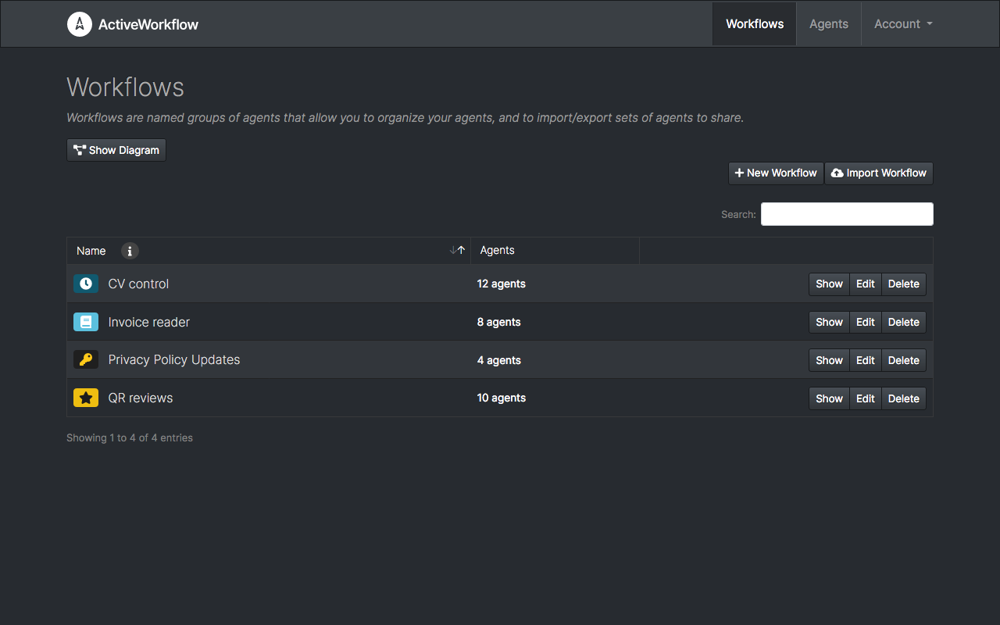
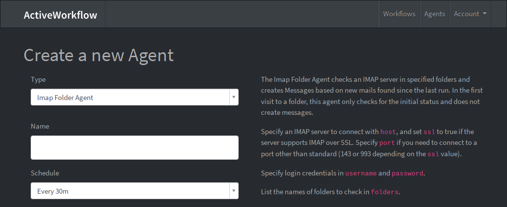
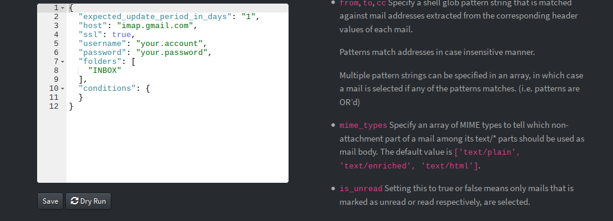
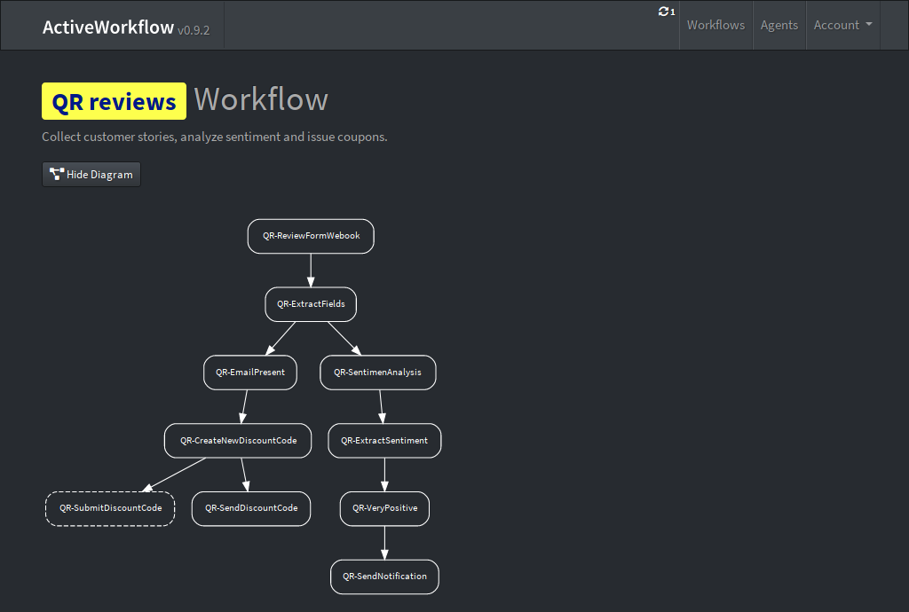
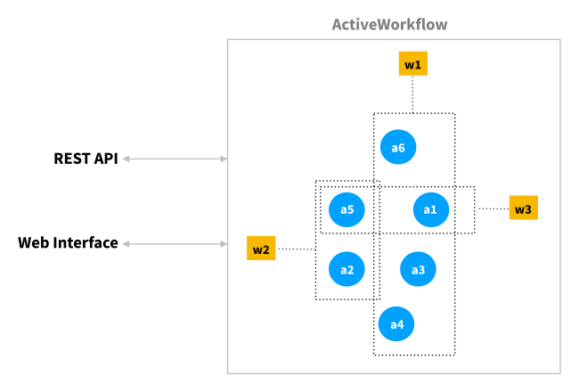

<a href="https://www.automaticmode.com"></a>

# ActiveWorkflow

[](https://circleci.com/gh/automaticmode/active_workflow)
[](https://codecov.io/gh/automaticmode/active_workflow)
[](LICENSE)


ActiveWorkflow is an intelligent process automation platform that uses
[software agents](https://en.wikipedia.org/wiki/Software_agent); autonomous
entities that act on schedule or react to external triggers. These unsupervised
agents connect to APIs, process information, perform routine tasks, and enable
you to automate internal or external workflows.

<div align="center"><a name="menu"></a>
  <h3>
    <a href="#overview">
      Overview
    </a>
    <span> • </span>
    <a href="#Usage">
      Usage
    </a>
    <span> • </span>
    <a href="#built-in-agents">
      Built-in Agents
    </a>
    <span> • </span>
    <a href="#custom-agents">
      Custom Agents
    </a>
    <span> • </span>
    <a href="#deployment">
      Deployment
    </a>
    <span> • </span>
    <a href="#development">
      Development
    </a>
  </h4>
</div>



## Overview

ActiveWorkflow is an intelligent process automation platform that uses software agents. A key objective when using ActiveWorkflow is to automate and orchestrate activities that would typically require human time and involvement. Thus, think more along the lines of replacing manual checking of websites, APIs, emails, and calendars rather than building low-level data pipelines (though that's also certainly possible). The basic concepts in ActiveWorkflow are **agents** and **workflows**. An overview of each follows below.

### Agents

Agents are of different types and each type typically knows how to
perform a simple task. For example, the HTTP Status Agent checks the status
returned from an HTTP request and emits a corresponding *message*, while the
Twilio Agent sends SMS messages or initiates phone calls.

Agents emit and receive messages (some only emit, or only receive). A structure
of agents designated as message sources and message targets forms a network. This
is what allows a group of agents to coordinate themselves and transform a
collection of simple tasks into sophisticated and complex behaviour.

Some agents are self-contained, like the Trigger Agent that watches for
specific values in the messages it receives. Others depend on complex third
party services, like the aforementioned Twilio Agent.

Agents perform actions either on schedule or when they receive a message. There
are also agents that can be triggered by external events. Agents are generally
stateful and can have memory. For example, the IMAP Folder Agent remembers the
last email it retrieved.

Each instance of an agent is configured by giving it a name, setting its schedule,
selecting the sources of the messages it receives (other agents), and choosing
among other common options:



Settings specific to a type of agent are often configured by editing
the agent's "options" presented as a JSON document:



Each agent type has in-line documentation explaining its functionality and all
its configuration options.

### Workflows

A network of agents can quickly become crowded, making it hard to discern
the whole picture. This is where the other key ActiveWorkflow concept comes into
play. Agents sharing common goals can be organised into *workflows*.

Workflows allow you to view and control groups of agents all at once. They can
also be exported and imported, so you can share automation solutions as a unit.



## Usage

Once you have ActiveWorkflow up and running you will want to create some agents and most probably to arrange them in one or more workflows. You can use ActiveWorkflow via its web interface and its <a href="#rest-api">REST API</a> as illustrated in the diagram below where a1-a6 are six agents and w1-w3 are three workflows these agents participate in.



### Creating Agents

There are currently three ways to create agents, listed below in order of ease:

1. You can create a new instance of a built-in agent type and configure it via the web interface following the agent's configuration options and inline documentation. With 30+ built-in agents you have the ability to address many common business workflows.
2. If the functionality you wish to achieve isn't directly possible with any of the built-in agents then you can use the (built-in) JavaScript agent which let's you write custom JavaScript code that can send and receive messages.
3. Finally, if none of the above offers you the flexibility or the functionality you wish to achieve you can code and plug-in your own ActiveWorkflow agent. This is currently possible in Ruby and we are working on providing the functionality to code first-class custom agents in other programming languages (Python, JavaScript, Clojure, etc.).

In the near future you'll also be able to programmatically create agents via the REST API. 

### Creating Workflows

To create a workflow you simply use the web interface (the "New Workflow" button) to enter a name, description, select an icon for your workflow, and then link to it the agents that participate in it. As we have already mentioned agents can participate in multiple workflows and exist independently of them. In this respect a workflow is more like a "tag" or a "label", rather than a "container".

In the near future you'll also be able to programmatically create workflows via the REST API.

## Built-in Agents

Below is a list of 30+ agents that come with ActiveWorkflow. These cover a wide spectrum of functionality and can be extensively configured and composed in workflows. Each agent comes with inline documentation within the web interface.

For writing your own custom agents see <a href="#custom-agents">Custom Agents</a>.

### Input/Output Agents

These are agents that connect your workflows to the outside world. Some of them can be used to interface with third party services when a dedicated agent is not (yet) available.

<table>
 <tr>
 	<td><strong>Webhook&nbsp;Agent</strong></td>
 	<td>Creates messages by receiving webhooks from any source.</td>
 </tr>
 <tr>
 	<td><strong>Data&nbsp;Output&nbsp;Agent</strong>
 	<td>Outputs received messages as either RSS or JSON. Use it to output a public or private stream of ActiveWorkflow data.</td>
 </tr>
 <tr>
 	<td><strong>HTTP&nbsp;Status&nbsp;Agent</strong></td>
 	<td>Will check a URL and emit the resulting HTTP status code with the time that it waited for a reply. Additionally, it will optionally emit the value of one or more specified headers.</td>
 </tr>
  <tr>
 	<td><strong>FTP Site Agent</strong></td>
 	<td>Checks an FTP site and creates messages based on newly uploaded files in a directory. When receiving messages it creates files on the configured FTP server.</td>
 </tr>
  <tr>
 	<td><strong>Website Agent</strong></td>
 	<td>Scrapes a website, XML document, or JSON feed and creates Messages based on the results.</td>
 </tr>
  <tr>
 	<td><strong>RSS Agent</strong></td>
 	<td>Consumes RSS feeds and emits messages when they change.</td>
 </tr>
  <tr>
 	<td><strong>Email Agent</strong></td>
 	<td>Sends any messages it receives via email immediately.</td>
 </tr>
  <tr>
 	<td><strong>Email&nbsp;Digest&nbsp;Agent</strong></td>
 	<td>Collects any messages sent to it and sends them all via email when scheduled.</td>
 </tr>
  <tr>
 	<td><strong>IMAP Folder Agent</strong></td>
 	<td>Checks an IMAP server in specified folders and creates messages based on new mails found since the last run.</td>
 </tr>
</table>

### Workflow and Data Processing Agents

These are agents that control the workflow and perform common and simple data processing operations.

<table>
 <tr>
 	<td><strong>Commander&nbsp;Agent</strong></td>
 	<td>Gets invoked on schedule or an incoming message, and commands other agents to run, disable, configure, or enable themselves.</td>
 </tr>
 <tr>
 	<td><strong>Buffer Agent</strong></td>
 	<td>Stores received messages and emits copies of them on schedule. Use this as a buffer/queue of messages.</td>
 </tr>
 <tr>
 	<td><strong>Post Agent</strong></td>
 	<td>Receives messages from other agents (or runs periodically), merges those messages with the Liquid-interpolated contents of payload, and sends the results as POST (or GET) requests to a specified URL.</td>
 </tr>
 <tr>
 	<td><strong>De-duplication Agent</strong></td>
 	<td>Receives a stream of messages and re-emits the message if it is not a duplicate.</td>
 </tr>
 <tr>
 	<td><strong>Manual&nbsp;Message&nbsp;Agent</strong></td>
 	<td>It is used to manually create Messages for testing or other purposes.</td>
 </tr>
 <tr>
 	<td><strong>Liquid&nbsp;Output&nbsp;Agent</strong></td>
 	<td>Outputs messages through a Liquid template you provide. Use it to create a HTML page, or a JSON feed, or anything else that can be rendered as a string from your stream of ActiveWorkflow data.</td>
 </tr>
 <tr>
 	<td><strong>JavaScript Agent</strong></td>
 	<td>Allows you to write JavaScript code that can create and receive messages. If other agents aren’t meeting your needs, try this one!</td>
 </tr>
 <tr>
 	<td><strong>Scheduler Agent</strong></td>
 	<td>Periodically takes an action on target agents according to a user-defined schedule.</td>
 </tr>
 <tr>
 	<td><strong>Attribute&nbsp;Difference&nbsp;Agent</strong></td>
 	<td>Receives messages and emits a new message with the difference or change of a specific attribute in comparison to the message received.</td>
 </tr>
  <tr>
 	<td><strong>Change Detector Agent</strong></td>
 	<td>Receives a stream of messages and emits a new message when a property of the received message changes.</td>
 </tr>
 <tr>
 	<td><strong>CSV Agent</strong></td>
 	<td>Parses or serializes CSV data. When parsing, messages can either be emitted for the entire CSV, or one per row.</td>
 </tr>
 <tr>
 	<td><strong>Gap Detector Agent</strong></td>
 	<td>Watches for "holes" or gaps in a stream of incoming Messages and generates "no data alerts".</td>
 </tr>
 <tr>
 	<td><strong>Read File Agent</strong></td>
 	<td>Takes messages from File Handling agents, reads the file, and emits the contents as a string.</td>
 </tr>
 <tr>
 	<td><strong>Trigger Agent</strong></td>
 	<td>Watches for a specific value in a message payload.</td>
 </tr>
 <tr>
 	<td><strong>Message&nbsp;Formatting&nbsp;Agent</strong></td>
 	<td>Allows you to format incoming messages, adding new fields as needed.</td>
 </tr>
 <tr>
 	<td><strong>Digest Agent</strong></td>
 	<td>Collects any messages sent to it and emits them as a single message.</td>
 </tr>
 <tr>
 	<td><strong>Peak Detector Agent</strong></td>
 	<td>Watches for peaks in a message stream.</td>
 </tr>
  <tr>
 	<td><strong>JSON Parse Agent</strong></td>
 	<td>Parses a JSON string and emits the data in a new message.</td>
 </tr>
</table>

### Third Party Service Agents

These agents use third party services to provide functionality. They typically require an account with these services.

<table>
 <tr>
 	<td><strong>Evernote&nbsp;Agent</strong></td>
 	<td>Connects with a user’s Evernote note store.</td>
 </tr>
 <tr>
 	<td><strong>Basecamp Agent</strong></td>
 	<td>Checks a Basecamp project for new messages.</td>
 </tr>
 <tr>
 	<td><strong>Human Task Agent</strong></td>
 	<td>It is used to create Human Intelligence Tasks on Mechanical Turk.</td>
 </tr>
 <tr>
 	<td><strong>S3Agent</strong></td>
 	<td>It can watch a bucket for changes or emit a message for every file in that bucket. When receiving messages, it writes the data into a file on S3.</td>
 </tr>
 <tr>
 	<td><strong>Jira Agent</strong></td>
 	<td>Subscribes to Jira issue updates.</td>
 </tr>
 <tr>
 	<td><strong>Twilio Agent</strong></td>
 	<td>Receives and collects messages, and sends them via text message or calls when scheduled.</td>
 </tr>
 <tr>
 	<td><strong>Twilio Receive Text Agent</strong></td>
 	<td>Receives text messages from Twilio and emits them as messages.</td>
 </tr>
 <tr>
 	<td><strong>Aftership Agent</strong></td>
 	<td>Allows you to track your shipments from Aftership and emit tracking status into messages.</td>
 </tr>
 <tr>
 	<td><strong>Google&nbsp;Calendar&nbsp;Publish&nbsp;Agent</strong></td>
 	<td>Creates events on your Google Calendar.</td>
 </tr>
 <tr>
 	<td><strong>Wunderlist Agent</strong></td>
 	<td>Creates new Wunderlist tasks based on incoming messages.</td>
 </tr>
 <tr>
 	<td><strong>Slack Agent</strong></td>
 	<td>Lets you receive messages and send notifications to Slack.</td>
 </tr>
</table>


## Custom Agents

You can create and use your own custom agents with ActiveWorkflow. There are
two ways to accomplish this:
- If you prefer to write your agents in Ruby you can do so by using the
   [custom agent API](docs/custom_agent_api.md).
- However, the more flexible and recommended way is to use the [remote agent
  API](docs/remote_agent_api.md), which allows you to write your agents in any
  programming language you choose.

## REST API

ActiveWorkflow provides a REST API to allow you to query and control your
agents and workflows programmatically from your own code.  We plan to provide
ActiveWorkflow API clients in multiple languages starting with Ruby and Python.

You can read more details about interfacing with ActiveWorkflow programmatically in the [REST API documentation](docs/rest_api.md).

## Deployment

### One-Click Heroku Deployment

The easiest way to start using ActiveWorkflow is by deploying it to
[Heroku](https://www.heroku.com/).

If you are reading this document in a browser all you need to do is click the
button bellow and fill in the environment variables for your seed user (admin):
`SEED_USERNAME`, `SEED_PASSWORD` and `SEED_EMAIL`. Please note that `SEED_PASSWORD` must be at least 8 characters long. 

[](https://heroku.com/deploy?template=https://github.com/automaticmode/active_workflow)

A free Heroku plan could be used to try out ActiveWorkflow, but it wouldn't be
enough for real use. That's because the limited run time and automatic turning
off of unused workers inhibits ActiveWorkflow from running scheduled tasks.

### Manual Heroku Deployment

If you would like more control or intend to deploy ActiveWorkflow from a modified
source tree, you could do that using Heroku's command line interface.

Please install Heroku's command line interface tool from
[Heroku Toolbelt](https://toolbelt.heroku.com).

For your convenience there is a helper script that guides you through all the
steps necessary to deploy to Heroku. It helps with Heroku app creation, plugin
installation, initial configuration and repository synchronisation. Helper
script is run with:

```sh
make setup-heroku
```

For additional configuration options please take a look at the `.env` file.
Don't forget to set any configuration options you may require using the
`heroku config` command line tool.

The default ActiveWorkflow configuration uses the same single dyno to run both
the web server and workers.

### Deployment with Docker

If you want to deploy ActiveWorkflow to a platform that uses docker
containers, you could make an ActiveWorkflow image.

Note: currently there is no official ActiveWorkflow image.

#### Requirements

To build, use, or try out a docker image you would need the following tools:
`docker` and `docker-compose`. (`docker-compose` is required if you plan to
run docker images locally for testing).

On a Mac the recommended way to install docker is
[here](https://docs.docker.com/docker-for-mac/install/).

On Linux please use your package manager or follow this [docker installation
guide](https://docs.docker.com/install/overview/).


#### Building the Image

You can build a docker image for deployment with:

```sh
make build-image
```

This creates an image named `local/active_workflow`.


#### Deployment with Docker to Heroku

You may prefer to use Heroku in a container mode (instead of deploying via
GitHub). Please be sure to login to Heroku docker registry before doing that:

```sh
heroku container:login
```

Docker deployment to Heroku happens in two steps. Push:

```sh
make heroku-docker-push
```

And release:

```sh
make heroku-docker-release
```

If you no longer wish to use image based deployment to Heroku you will need to
reset Heroku stack to `heroku-18` like this:

```sh
heroku stack:set heroku-18
```

## Development

### Requirements

ActiveWorkflow is built using Ruby and is a Ruby on Rails app.

Install all dependencies with:

```sh
gem install bundler
bundle
```

Diagrams are rendered using the `dot` tool from `Graphviz`. On a Mac install
`Graphviz` with:

```sh
brew install graphviz
```

### Running Locally without Docker

If you want to test out ActiveWorkflow locally you can start a demo instance
using a local sqlite database. First prepare the database with:

```sh
bundle exec rake db:create
bundle exec rake db:migrate
bundle exec rake db:seed
```

You can start the instance by running:

```sh
make start
```

This starts the ActiveWorkflow instance on a local address
[localhost:3000](http://localhost:3000) with default username "admin" and
password "password".

The local instance uses the configuration stored in a `.env` file. You could
tweak it or use it as guidance when configuring your deployment target.

Tests can be run with `make test`.


### Running Locally with Docker

You can test ActiveWorkflow using docker locally. Run it (with a PostgreSQL
database in a separate container):

```sh
docker-compose up
```

This starts ActiveWorkflow instance on a local address
[localhost:3000](http://localhost:3000) with default login "admin" and password
"password".

Stop containers with:

```sh
docker-compose down
```

## Acknowledgements

ActiveWorkflow started as a fork of [Huginn](https://github.com/huginn/huginn) with the
goal of solely targeting business use. ActiveWorkflow is incompatible with Huginn.


## License

ActiveWorkflow is released under the [MIT License](LICENSE).
