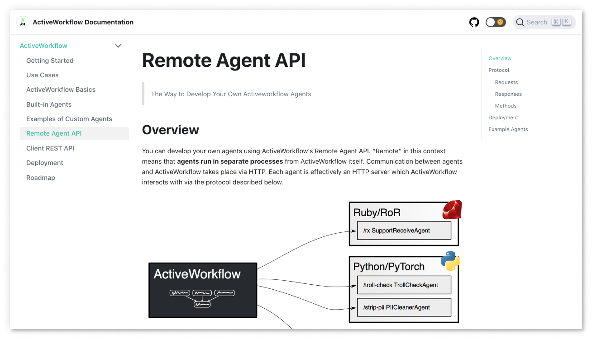

<h3 align="center">
    <br>
    <a href="https://www.activeworkflow.org"></a>
</h3>

<h3 align="center">
    Turn complex requirements to workflows<br> without leaving the comfort of your technology stack
</h3>

<br>

<p align="center">
    <a href="https://circleci.com/gh/automaticmode/active_workflow"></a>
    <a href="https://codecov.io/gh/automaticmode/active_workflow"></a>
    <a href="https://github.com/automaticmode/active_workflow/releases/latest"></a>
    <a href="https://github.com/automaticmode/active_workflow/blob/master/LICENSE"></a>
</p>

<h4 align="center">
  <a href="#getting-started">Getting Started</a> •
  <a href="https://docs.activeworkflow.org/">Documentation</a>
</h4>

## About

ActiveWorkflow works alongside your existing technology stack to give you an easy and structured way to:

- **Group business logic for periodic execution**—for example, to generate and distribute a weekly PDF report.
- **Poll resources**—for example, to check if a file has become available on S3.
- **Orchestrate event-driven functionality**—for example, to trigger a customised email campaign in reaction to a pattern of user behaviour.

You can do all of the above by creating, scheduling, and monitoring workflows of agents, which are self-contained services (or microservices) written in any programming language you choose. ActiveWorkflow as a platform gives you a simple way for connecting your agents (services), extensive logging, state management, and a foundation to build a scalable and reliable system without vendor lock-in.

ActiveWorkflow **is not a no-code platform**, but it does offer a fully featured UI so that both software engineers and other stakeholders can manage and monitor workflows.

<h4 align="center">Periodic Execution ◆ Polling ◆ Orchestration</h4>


## Getting Started


See the [Getting Started documentation page](https://docs.activeworkflow.org/) for full details.

If you are in a hurry and wish to take a sneak peek, you can try ActiveWorkflow in one of the following ways.


### Try it with Docker

```sh
docker run -p 3000:3000 --rm automaticmode/active_workflow
```

Once it starts you can login at `http://localhost:3000` with `admin`/`password`.

### Try it on Heroku

Another quick and easy way to check out ActiveWorkflow is by deploying it on
[Heroku](https://www.heroku.com/).

All you need to do is click the button bellow and fill in the environment variables for your seed user (admin):
`SEED_USERNAME`, `SEED_PASSWORD` (must be at least 8 characters long) and `SEED_EMAIL`.

[](https://heroku.com/deploy?template=https://github.com/automaticmode/active_workflow&env[SINGLE_DYNO]=1)

*Note: this configuration is not recommended for production, please see [Getting Started - Running on Heroku](https://docs.activeworkflow.org/#running-on-heroku) for more details.*

## Documentation

You can find the full project documentation at [docs.activeworkflow.org](https://docs.activeworkflow.org/).

<a href="https://docs.activeworkflow.org/">
</a>

## Acknowledgements

ActiveWorkflow started as a fork of [Huginn](https://github.com/huginn/huginn) with
the goal of targeting solely business use, API and polyglot functionality, and a smaller codebase. ActiveWorkflow is incompatible with Huginn.


## License

ActiveWorkflow is released under the [MIT License](LICENSE).
