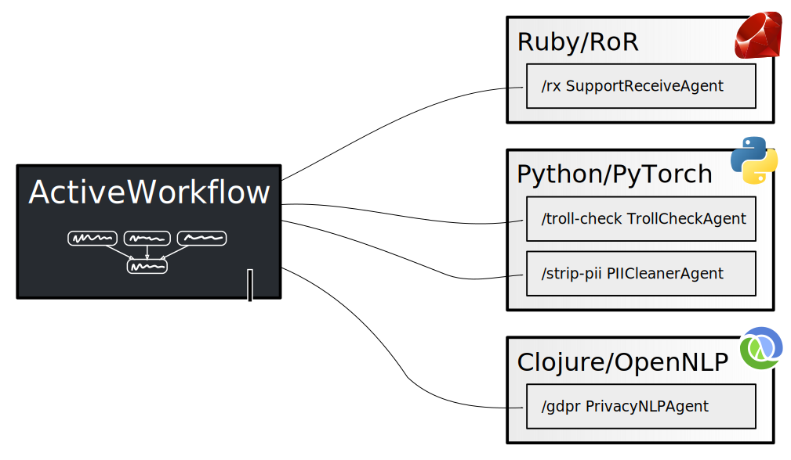

# Remote Agent API

You can create your own custom agents using ActiveWorkflow's Remote Agent API. "Remote" in this context means that agents are run in a separate processes from the
ActiveWorkflow itself. Communication between agents and Active Workflow happens
via the HTTP protocol. Each agent is an HTTP server and ActiveWorkflow connects to
it to perform the work.



## Deployment

The freedom to implement remote agents using any technology stack you are
comfortable with also has a cost. That of deploying and running the agents.
Each agent has to expose a single endpoint. ActiveWorkflow **will not** restart
or interfere with your agents' process (or container) in any way. We suggest
that you use a supervisor of your choice (systemd?) or functionality provided
by docker and it's orchestration solutions. We intend to create some guidelines
and examples for the most common deployment scenarios, please stay tuned.

To inform ActiveWorkflow about an agent you have to set an
environment variable pointing to the URL of the agent:

```sh
REMOTE_AGENT_URL=https://localhost:4567/agent_path
```

You can configure multiple agents by setting multiple environment variables
with postfix appended to the end of variables' name:

```sh
REMOTE_AGENT_URL_2=https://otherhost:80/another_agent
```

> ⚠️ Currently there is no authorisation support when connecting to remote
> agents, please ensure URLs are not publicly accessible!

## Protocol

ActiveWorkflow talks to an agent using the HTTP protocol and all the contents (both
request and response) are in JSON. Although all communication happens using a
single endpoint, an agent has to implement and handle three "methods". All
requests have the following structure:

```js
{
  "method": method,
  "params": params
}
```

Where `method` is the name of the method, `params` is a JSON object (key/value pairs) that holds all the parameters to the `method` call.

A response from the agent has the following structure:

```js
{
  "result": result
}
```

Where `result` is a JSON object (key/value pairs).

> ⚠️ Additional fields can be present in the request's JSON object, please
> only use the ones described in this document. Any additional fields are not
> guaranteed to exist or to have any fixed meaning.

There are three methods an agent has to implement

### `register` method

This method is used by ActiveWorkflow to retrieve an agent's metadata.
It is invoked once, when ActiveWorkflow starts.

This method doesn't use any parameters.

Example request:

```js
{
  "method": "register",
  "params": {}
}
```

An agent has to respond with the metadata describing it.

Example response:

```js
{
  "result": {
    "name": "MyAgent",
    "display_name": "My Agent",
    "description": "My *First* Agent",
    "default_options": { "option": "value" }
  }
}
```

Where:

- `name`: the name of an agent to be used in the agent type registry. It must be a
  unique identifier written in CamelCase;
- `display_name`: the name of an agent to be used for UI purposes;
- `description`: the (Markdown) description of an agent. It should include
   an introduction and usage information, including a description of all
   configuration options;
- `default_options`: the default options that a user can use as a starting
   point when configuring an agent; this is an object (key/value collection).

### `receive` method

This is the method that ActiveWorkflow calls when an agent has to process a
message. The contents of the message are in the `payload` field. Additionally
ActiveWorkflow submits all the configuration, memory (state) and user
credentials that an agent may need.

> ⚠️ Agents in ActiveWorkflow are state-full entities, but your agent
> implementation (`receive` and `check` methods) should be completely state-less.
> All the _necessary_ "state" is passed in as parameters. Your agent
> implementation should not store any data except in third party systems if that
> is the intended behaviour of an agent (i.e. an ElasticSearch agent may store
> messages in an ElasticSearch instance, but even then the URL to that instance
> should come from parameters). Agents can do some caching, but it should be done
> very carefully, the agent ID is not in the parameters and you can't be sure if the
> same agent instance will be scheduled next time).

Example request:

```js
{
  "method": "receive",
  "params": {
    "message": {
      "payload": { "a": 1, "b": 2 }
    },
    "options": {
      "option": "value",
      "email_credential": "admin_email"
    },
    "memory": {
      "key": "value"
    },
    "credentials": [
      { "name": "admin_email", "value": "x@example.com" }
    ]
  }
}
```

Where:

- `message`: the message object that an agent has to process, it must include a `payload` object;

- `options`: the configuration options for an agent, this is an object;

- `memory`: the memory (state) of an agent, can be updated by an agent;

- `credentials`: array of user credentials; these are key/value pairs of
  strings that the user sets to be used by an agent. Presence of any hard-coded
  credentials should not be expected. Credential data should be only used if
  explicitly configured by the user, like in the example above
  where the `email_credential` option explicitly refers to the `admin_email` credential.

An agent should respond with the response that includes new messages emitted, log
entries, error log entries and updated memory.

Example response:

```js
{
  "result": {
    "errors": [
      "Something failed",
      "Something more failed"
    ],
    "logs": [
      "Something happened",
      "Something else happened"
    ],
    "memory": {
      "key": "new value"
    },
    "messages": [
      {
        "a": 5
      },
      {
        "a": 6
      }
    ]
  }
}
```

Where:

- `errors`: optional, an array of error strings if errors occurred during execution;

- `logs`: optional, an array of strings to log, for debugging/info purposes;

- `memory`: optional, new content of the memory for an agent, old memory
  content will be **replaced** with the new content;

- `messages`: optional, an array of message payloads; each payload must be an
  object. In the example there are two messages emitted.


### `check` method

The `check` method is very much like the `receive` method, but is called on schedule
(set by the user) and has no message to process. It should be used when you want
your agent to perform some side effect and (optionally) to get some data from an 
external service. I.e. check an email Inbox and emit the number of unread messages.

Everything else is exactly like in the `receive` method. The `check` method can
emit messages, write logs and errors, and update memory.

> ⚠️ Agents in ActiveWorkflow are state-full entities, but your agent
> implementation (`receive` and `check` methods) should be completely state-less.
> All the _necessary_ "state" is passed in as parameters. Your agent
> implementation should not store any data except in third party systems if that
> is the intended behaviour of an agent (i.e. an ElasticSearch agent may store
> messages in an ElasticSearch instance, but even then the URL to that instance
> should come from parameters). Agents can do some caching, but it should be done
> very carefully, the agent ID is not in the parameters and you can't be sure if the
> same agent instance will be scheduled next time).

Example request:

```js
{
  "method": "check",
  "params": {
    "message": null,
    "options": {
      "option": "value"
    },
    "memory": {
      "key": "value"
    },
    "credentials": {
      "email": "x@example.com"
    }
  }
}
```


Example response:

```js
{
  "result": {
    "errors": [
      "Something failed",
      "Something more failed"
    ],
    "logs": [
      "Something happened",
      "Something else happened"
    ],
    "memory": {
      "key": "new value"
    },
    "messages": [
      {
        "a": 5
      },
      {
        "a": 6
      }
    ]
  }
}
```

Where:

- `errors`: optional, an array of error strings if errors occurred during execution;

- `logs`: optional, an array of strings to log, for debugging/info purposes;

- `memory`: optional, new content of the memory for an agent, old memory
  content will be **replaced** with the new content;

- `messages`: optional, an array of message payloads; each payload must be an
  object. In the example there are two messages emitted.

## Example

You can take a look at an example remote agent written in Python
[here](https://github.com/automaticmode/aw_python_sample_agent).
